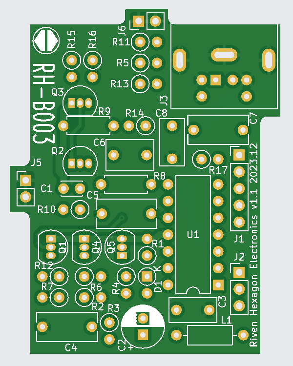

# RHCCV - Color Computer 2 S-Video and Composite Mod with Audio 

The ***RHCCV*** is a video mod for the ***Tandy Radio Shack Color Computer 2***. The modification **replaces** the **original** video **module** (the shiny metal box) of the *CoCo2*. It features a **6-pin** or **4-pin** compatible **Mini DIN** connector with **S-Video**, **Composite Video** and **Audio** outputs.

The [/jlcpcb](https://github.com/RivenHexagon/CoCo2_Video/tree/main/jlcpcb) folder contains production-ready files that can be directly uploaded to [jlcpcb.com](https://jlcpcb.com/) for PCB manufacturing.

## Compatibility
The current printed circuit board layout is designed to fit the CoCo2 model with a **horizontally** mounted RF **modulator** case. However, the modification itself would **also** work on earlier CoCo2 versions that use a **vertically** mounted modulator box. The only **differences** are in the **pinout** and the PCB **form factor**.

## Assembly and Installation
### 4-pin Mini DIN installed *(S-Video only)*
The **PCB** populated with a **4-pin** Mini DIN connector delivers **S-Video** as the **only** available **output**. The **pinout** is **standard** S-Video, as described [here](https://en.wikipedia.org/wiki/S-Video "S-Video Wikipedia").

### 6-Pin Mini DIN installed *(S-Video, Composite and Audio)*
The **6-pin** connector installed on the **PCB** makes **all** outputs available **simultaneously**. However, this requires a **custom** made **breakout cable** in order to **access** the **signals** individually. A veteran **PS/2** cable can be **modified** but please note that in some cables **not all pins** are **connected**.

The 6-pin Mini DIN connector has the following **pinout**:
* Pin 1: **Audio** out
* Pin 2: **Composite** Video
* Pin 3: **GND**
* Pin 4: **GND**
* Pin 5: **Luma** (Y)
* Pin 6: **Chroma** (C)

The KiCad PCB design uses a custom footprint for *ASSMANN* Mini DIN Connectors: 
<https://www.assmann-wsw.com/uploads/datasheets/ASS_1622_CO.pdf>

### Installation
* Desolder the **clamps** of the **metal** box and the **pin headers** of the original video module from the **main board**. (It is recommended to use a **desoldering pump** and **solder wick**)
* Carefully **desolder** the ***MC1372*** from the PCB of the original video module.
* On the RHCCV **PCB**, install a 14-pin **[IC socket](https://www.assmann-wsw.com/uploads/datasheets/ASS_0810_CO.pdf)** for **U1**, rather than soldering the ***MC1372*** directly onto the board.
* Make sure that the **pins** of the *MC1372* are **free of solder** and plug it into the **IC socket** of the RHCCV. Mind the correct **orientation**.
* Populate the remaining components listed in the [Bill of Materials](https://github.com/RivenHexagon/CoCo2_Video/blob/main/TRS-80-VideoMod-BOM.pdf).

The new PCB uses the **same** pin headers as the **original** module and does not require any additional wires to be pulled.

## The Mod
The **design** draws **inspiration** from the research and work of ***[AC's 8-bit Zone](https://youtu.be/tayGsz7Xs3A "ACs 8-bit Zone - YouTube")*** on *YouTube*. The RHCCV mod **integrates** his **S-Video** and **Conmposite Video** circuits into a **single** PCB.

Unlike his approach, which involved modifying the original hardware and routing loose cables externally, this mod uses **Mini DIN** connectors, offering several **advantages**:

* **Preserves** the **original hardware** (except for desoldering the *MC1372*)
* **Eliminates loose cables** exiting the TRS-80 case
* **No case modification** for extra connectors required

